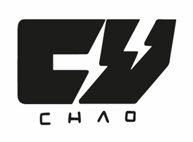

# Cuchao   
Carrito a control remoto
 
## Descripción
Cuchao es un carro controlado remotamente mediante una aplicación para teléfono que envía instrucciones vía bluetooth. Este proyecto incluyo el diseño y construcción de las distintas partes que componen un vehículo con la apariencia del Rayo Mcqueen cuyo control remoto le permite avanzar, retroceder y cambiar su dirección dependiendo de las instrucciones que reciba de la aplicación de teléfono

## Componentes
- Arduino nano
- Modulo Driver de motor L298N
- Modulo Bluetooth HC-06
- Servomotor SG90
- Motorreductor
- Carcasa de Rayo Mcqueen – hecha por Madelyne Horna
- Chasis impreso en 3D – [Proyecto de Onshape](https://cad.onshape.com/documents/87963e691d966ac7c244ff20/w/031962104d2e9feff3d570e5/e/7f291b91b8350b6e01bdd2b9?renderMode=0&uiState=67c9d1c9c1297a5b13cb4ace)
- App de control remoto – [Link de descarga](https://apkpure.com/es/bluetooth-rc-car/braulio.calle.bluetoothRCcontroller)

## Funcionamiento
Cuchao funciona gracias al microcontrolador del Arduino nano el cual, gracias al modulo Bluetooth, es capaz de establecer una conexión con la aplicación de teléfono, esta aplicación envía mensajes de una sola letra según el botón que el usuario este presionando en la aplicación (Por ejemplo “S” para stop en caso de que no se esté presionando nada) el Arduino recibe este mensaje y dependiendo de la letra que reciba activa las salidas necesarias para prender o apagar los moteres o colocar el servomotor en una posición especifica.
La potencia para generar movimiento es entregada por dos motorreductores conectados directamente a las ruedas traseras del vehículo, estos motores no están conectados directamente al Arduino si no que son controlados por el Driver de motor L298N el cual se encargar de suministrar energía tanto a los motores como al Arduino.
La fuente de energía del Cuchao es una batería alcalina de 9V conectada a al driver de motor, se espera en un futuro poder cambiar esta batería por una recargable de mayor capacidad.

## Diagrama de circuito 

Hecho en KiCad

## Versiones
- V1: En la primera versión de este proyecto se implementó un chasis genérico para carro robótico con una modificación para permitir la dirección de las ruedas delanteras mediante el servomotor, pero al estar este chasis diseñado para un vehículo de cuatro servomotores, no se tenia el espacio suficiente para que las ruedas giren.

- V2: Para la segunda versión se optó por hacer un chasis propio con palitos de madera de distintos tamaños, lo cual soluciono el problema de la dirección pero la estructura resulto ser muy débil e inestable.
- V3: Para la esta versión se rediseño el chasis en OnShape para imprimirlo en 3D, esto aumento la resistencia y la estabilidad del vehículo pero todavía se puede mejorar el diseño del chasis.

## Imagenes del proyecto

